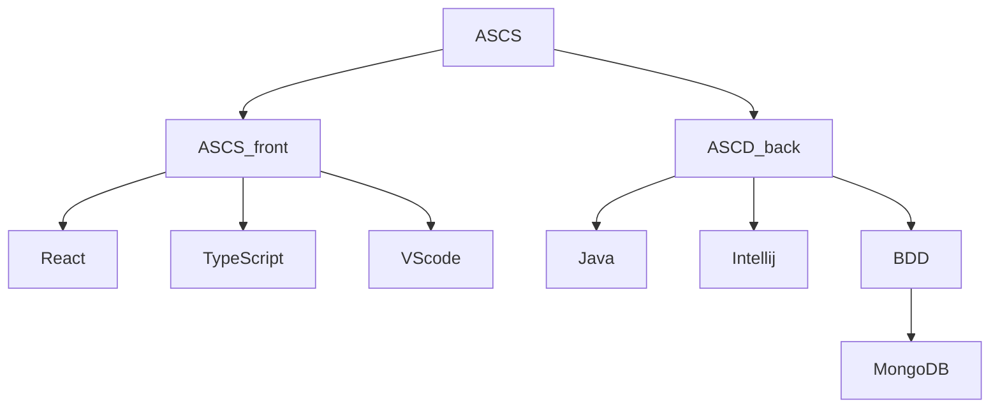

# devops_tp_ynov
Entreprise : SopraSteria

Silot : Je ne sais pas

Pratique : méthode agile

Processus de build : Je ne sais pas

Processus de déploiement : Je ne sais pas

Processus de release : Je ne sais pas

Moyen de teste : Mockito

