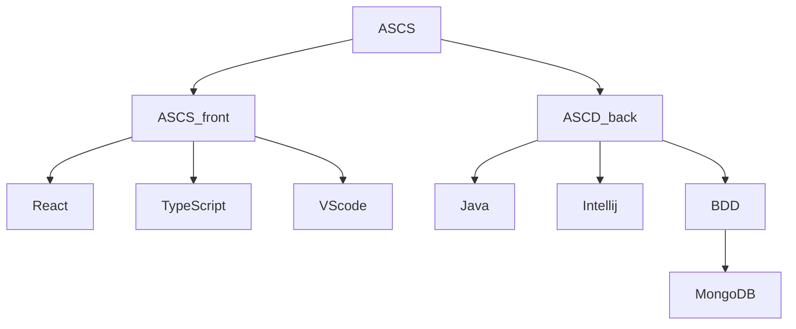

# devops_tp_ynov
Entreprise : SopraSteria
Silot : Je ne crois pas qu'il y en a
Pratique : méthode agile

Processus de build : npm
Processus de déploiement :
Processus de release :
Moyen de teste : 
